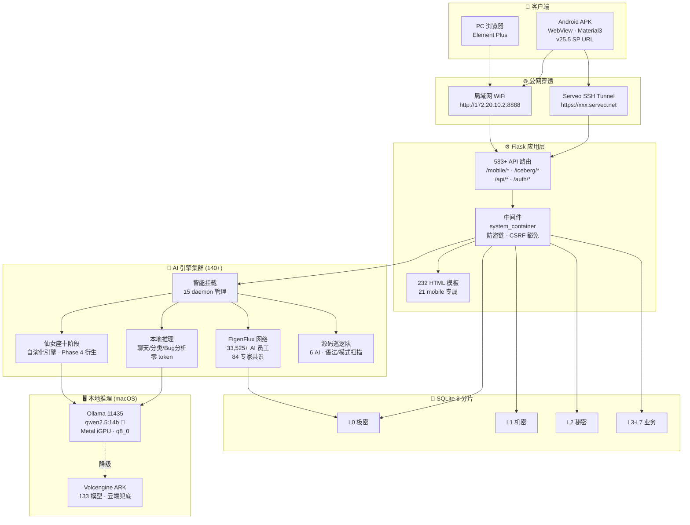

# 🌊 MTSCOS AI — 冰山智能管理系统

[](https://www.python.org/)
[](https://flask.palletsprojects.com/)
[](https://developer.android.com/)
[](LICENSE)
[](#)
[](https://www.sqlite.org/)

> **AI 原生** · **全学段** · **自演化** · **本地优先**

AI 驱动的全学段教育智能管理平台。融合机器学习、知识图谱和自主进化引擎，覆盖 **K12 → 高等 → 职业 → 继续教育** 四大场景，33,525+ AI 员工全天候协作。

---

## ✨ 核心亮点

### 🤖 仙女座十阶段自演化引擎 · Phase 4 衍生
- **十阶段流水线** eigenflux_ingest → detect → retrieve → associate → derive → reinforce → expand → optimize → **🧠 自研拓展 gap_fill → 🔁 冰山广播 broadcast → ⚡ Phase 自动升级**
- **Phase 8 级演化体系**：混沌 → 感知 → 觉醒 → **衍生 (当前)** → 江山 → 星海 → 归一 → 永恒
- 267.8s/cycle · Cycle #66 首次 embedding 出向量 → 语义检索真正工作 → Phase 3→4 自动升级
- Ollama 11434 动态端口检测 · qwen2.5:14b + nomic-embed-text 768维
- 冰山广播推给 AI 员工 → 触发 EigenFlux 讨论 → 摄入脑库 → 下轮再演化 **🌀 自举闭环**

### 🧠 三层 AI 降级链路 · 永不宕机
```
本地 Metal iGPU 14b → 本地 CPU 7b → Volcengine ARK 云端
```
macOS Metal iGPU 原生推理 · 零 token 消耗优先

### 📱 移动端 APK v25.5
- Material3 + AndroidX WebView 容器
- SharedPreferences **动态服务器地址**（换网络不用重打包）
- 15 条移动端路由 · 21 个模板 · TabBar 四段式导航

### 🛡️ 纵深防御安全
- §14 IRON RULE — 12 步骤强制开发流程（3 层拦截）
- VIKEY 硬件加密狗双钥匙认证
- 11 级角色权限 · @system_container 装饰器
- 5 级机密等级 · 防盗链拦截

### 🗄️ 8 分片数据库架构
- **4,819+ 张** 数据库表
- WAL 模式 + busy_timeout 热切换
- L0 极密 → L7 分析透明加解密
- 规则治理 3 表（完整性自动扫描）

---

## 🏗️ 系统架构



### 数据流
```
用户 → APK/WebView → Flask Route → Middleware(权限/防盗链)
                                    ↓
                           ┌────────┴────────┐
                           ↓                 ↓
                      SQLite 8 分片      AI 引擎集群
                           ↓                 ↓
                     查询/写入表       Ollama 本地推理
                           ↓                 ↓
                     返回 JSON/HTML   EigenFlux 广播
```

---

## 🚀 快速开始

### 环境要求
- macOS / Linux（Windows 可走 Docker）
- Python 3.14+
- [Ollama](https://ollama.com) （本地推理）+ qwen2.5:14b 模型
- Android Studio / apktool （APK 重打包，可选）

### 1. 克隆 & 安装
```bash
git clone git@github.com:wuchenghao15/MTSCOS.git
cd MTSCOS
python3 -m venv .venv && source .venv/bin/activate
pip install -r flask-app/requirements.txt
```

### 2. 启动 Flask
```bash
cd flask-app
python3 modular_start.py
# → http://localhost:8888
```

### 3. 移动端 APK 安装
```bash
# 手机同 WiFi 打开
http://<电脑局域网IP>:8888/mobile/apk

# 或 adb 安装
adb install -r MTSCOS-AI-Mobile-v25.5.0-debug.apk
```

### 4. 公网穿透（可选）
```bash
# Serveo SSH（每次 URL 变）
ssh -R 80:localhost:8888 serveo.net

# APK 内改 URL（SharedPreferences）
adb shell run-as com.mtscos.mobile \
  sh -c 'echo "<?xml version=\"1.0\"?><map><string name=\"server_url\">https://NEW-URL.serveousercontent.com/mobile/login</string></map>" > shared_prefs/mtscos_prefs.xml'
```

---

## 📊 系统规模

| 指标 | 数值 |
|------|------|
| 系统版本 | **v25.5.0** (2026-10-05 · 十阶段演化引擎 Phase 4 衍生) |
| 演化 Phase | **Phase 4 衍生** (8 级体系: 混沌→感知→觉醒→衍生→江山→星海→归一→永恒) |
| 演化状态 | **自举闭环已打通** · Cycle #66 267.8s · embedding 768维 |
| 数据库表 | **4,819+** 张 |
| AI 员工 | **33,525+** 人 |
| API 路由 | **583+** 条 |
| HTML 模板 | **232** 个 |
| AI 引擎 | **140+** 个 |
| daemon 进程 | **15** 个（smart_mount 管理） |
| 安全级别 | L0 IRON_RULE → L1-L4 五级 |
| 数据库分片 | **8** 个（L0 极密 → L7 分析） |

---

## 🛠️ 技术栈

| 层 | 技术 |
|----|------|
| **后端** | Flask 3.1+ · Python 3.14 |
| **数据库** | SQLite WAL · 8 分片 · 4819+ 表 |
| **AI/ML** | Ollama Metal iGPU · qwen2.5:14b · Volcengine ARK |
| **安全** | bcrypt · cryptography · VIKEY USB · @system_container |
| **前端** | HTML5 · Element Plus · Material3 |
| **移动端** | AndroidX WebView · Material3 · minSdk 24 |
| **部署** | macOS LaunchAgents · SSH serveo · smart_mount_engine |

---

## 📚 文档

| 文档 | 说明 |
|------|------|
| [系统架构](docs/ARCHITECTURE.md) | 8 分片数据库 · AI 引擎集群 · 仙女座自演化流程 |
| [部署指南](docs/DEPLOYMENT.md) | Flask 启动 · serveo 穿透 · APK 安装 · VIKEY 配置 |
| [API 参考](docs/API.md) | /mobile/* 15 条 · /iceberg/* API · /auth/* 路由 |
| [更新日志](docs/CHANGELOG.md) | v25.5.0 → v22.0.0 版本迭代 |
| [贡献指南](.github/CONTRIBUTING.md) | 开发规范 · §14 IRON_RULE 12 步骤 |

---

## 🏷️ Topics

`flask` `android-webview` `ai-education` `question-bank` `material3` `ollama` `metal-igpu` `multi-agent` `self-evolution` `k12` `higher-education` `edtech` `sqlite` `database-sharding` `security` `iron-rule` `vikey` `self-hosted` `sharedpreferences`

---

## 📄 许可

MIT License © 2026 wuchenghao15 / MTSCOS AI — 详见 [LICENSE](LICENSE)

---

## 📞 联系方式

- GitHub: [wuchenghao15](https://github.com/wuchenghao15)
- 项目: [MTSCOS](https://github.com/wuchenghao15/MTSCOS)
